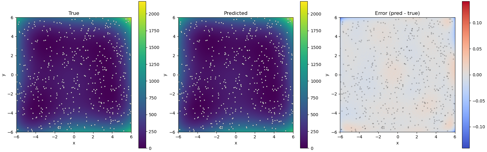

例：関数モデリングのためのガウス過程回帰
========================================

はじめに
--------

このチュートリアルでは、ODAT-SEフレームワークを使用して、ガウス過程 (GP) 回帰により未知の関数をモデル化する方法を説明します。実験のケースでは、パラメータの組み合わせについて限られた数のデータポイントしか得られないことがよくあります。このチュートリアルの目標は、いくつかの異なる実験条件で得られた実験結果に対応する点のサブセットから関数をモデル化し、再構成されたモデルから真の関数の最小値を推定することです。

問題設定
--------

実験測定データ :math:`D \equiv \{(x_i,y_i,t_i)\}_i` を考えます。ここで：

- :math:`i` は、与えられたデータセットの :math:`n` 個のデータポイントのインデックスです。(:math:`i` は1から :math:`n`)
- :math:`(x_i,y_i,t_i)` は :math:`i` 番目の測定を表します。 :math:`x_i` と :math:`y_i` は (ノイズを含む) 測定 :math:`t_i` の状態パラメータです。

このチュートリアルの目的は：

1. データと最もよく適合するガウス過程モデルのハイパーパラメータを決定すること、および
2. データセット上の回帰モデルから得られた代理(surrogate)モデルを使用して真の関数の最小値を推定すること、です。

ここでは、ODAT-SE の ``SolverBase`` を継承するカスタムソルバーを実装して最小値を推定します。このソルバーは、フィッティングされたGPモデルを介して入力に対する予測を評価します。このチュートリアルに必要なモジュールは次のとおりです：

.. code:: python

	import sys, os, argparse
	import numpy as np
	import odatse
	from sklearn.preprocessing import StandardScaler
	from sklearn.gaussian_process import GaussianProcessRegressor
	from sklearn.gaussian_process.kernels import RBF, ConstantKernel, WhiteKernel
	import matplotlib.pyplot as plt
	from matplotlib.colors import CenteredNorm

サンプルデータセットの生成
~~~~~~~~~~~~~~~~~~~~~~~~~~

テスト関数として、次の式で表される Himmelblau 関数を考えます：

.. math::

	f(x,y)=(x^2+y-11)^2+(x+y^2-7)^2

Pythonコードでの実装は次のとおりです：

.. code:: python

	def himmelblau(x, y):
		return (x**2 + y - 11.0) ** 2 + (x + y**2 - 7.0) ** 2

サンプルデータポイントを探索空間内で一様ランダムに生成し、少量のノイズを加えます。得られたデータセットは、訓練セットとテストセットに分割されます。

.. code:: python

	def make_data(f, N, xrange, yrange, noise = 0.01):
		x = np.random.uniform(*xrange, N)
		y = np.random.uniform(*yrange, N)
		t = (f(x, y) + noise * np.random.randn(N)).astype(np.float32).reshape(-1, 1)
		X = np.stack([x, y], axis=1).astype(np.float32)
		return X, t
	
	def split_data(X, t, n_train, n_test):
		ids = np.random.choice(len(t), len(t), replace=False)
		id_tr = ids[:n_train]
		id_te = ids[n_train:n_train + n_test]
		return X[id_tr], t[id_tr], X[id_te], t[id_te]

ガウス過程回帰
~~~~~~~~~~~~~~

この例では、次のカーネルを使用してガウス過程回帰を実行します：

.. math::

	k(x_i,x_j)=\theta_0^2\exp\left(-\frac{\lVert x_i-x_j\rVert^2}{2\theta_1^2}\right)+\theta_2\delta_{ij}

ここで、 :math:`\lVert\cdot\rVert` はベクトル :math:`x_i` と :math:`x_j` の間のユークリッド距離です。 :math:`\theta_0`, :math:`\theta_1`, :math:`\theta_2` は、フィッティングで最適化されるハイパーパラメータです。

GPを次の関数で初期化します。引数 ``Xtr`` (入力) と ``ttr`` (ターゲット) は訓練データを受け取ります。

.. code:: python

	def gplearn(Xtr, ttr, seed):
		kernel = ConstantKernel(1.0, (0.1, 1e6)) * RBF(1.0, (0.1, 10.0)) + WhiteKernel(noise_level=0.01, noise_level_bounds=(1e-16, 1))
		
		gpr = GaussianProcessRegressor(kernel=kernel, n_restarts_optimizer=20, normalize_y=False, random_state=seed)
		gpr.fit(Xtr, ttr)
		print(f"Hyperparameters: {np.exp(gpr.kernel_.theta)}")
		print(f"Fitted kernel: {gpr.kernel_}")
		
		def predictor(X):
			X = np.asarray(X, dtype=np.float32)
			if X.ndim == 1:
				X = X.reshape(1, -1)
			ts = gpr.predict(X).astype(np.float32)
			return ts  # (N,)
		return predictor

フィッティングは関数内で実行されます (``sklearn.gaussian_process.GaussianProcessRegressor`` の ``fit()`` を使っています) 。このサブルーチンは、入力変数を受け取り予測量を出力する予測子に対応する関数を返します。

データの正規化
^^^^^^^^^^^^^^

データをGPフィッティング関数に渡す前に、まずデータを適切に正規化します。これは次のクラスで行われます：

.. code:: python

	class Converter:
		def __init__(self, X, t):
			self.scaler_X = StandardScaler()
			self.scaler_t = StandardScaler()
			
			self.scaler_X.fit(X)
			self.scaler_t.fit(t)
		
		def convert_X(self, X):
			X = np.asarray(X, dtype=np.float32)
			if X.ndim == 1:
				X = X.reshape(1, -1)
			return self.scaler_X.transform(X).astype(np.float32)
		
		def convert_t(self, t):
			return self.scaler_t.transform(t).astype(np.float32)
		
		def revert_t(self, t_scaled):
			if t_scaled.ndim == 1:
				t_scaled = t_scaled.reshape(-1, 1)
			t_proc = self.scaler_t.inverse_transform(t_scaled)
			return t_proc.reshape(-1).astype(np.float32)
		
		def gen_predictor(self, predictor_raw):
			def predictor(X):
				Xs = self.convert_X(X)
				ts = predictor_raw(Xs)
				return self.revert_t(ts)
			return predictor

``Converter`` インスタンスの初期化中に、スケーラはデータに合わせて調整されます。前のセクションで定義された予測子関数を ``gen_predictor()`` に渡します。それにより、データを正規化してから最適なモデルを計算する関数が得られます。

ODAT-SEの実装
-------------

コード実装
~~~~~~~~~~

このチュートリアルでは、ファイルはリポジトリ内の ``sample/gpr`` に配置されています。メインスクリプトは ``gpr.py`` という名前です。

``SolverBase`` クラスから派生
^^^^^^^^^^^^^^^^^^^^^^^^^^^^^

ODAT-SEの ``SolverBase`` クラスを使用してカスタムソルバーを定義します。ここでは、汎用的な予測子関数のソルバーを定義します。

.. code:: python

	class PredictorSolver(odatse.solver.SolverBase):
		def __init__(self, info, predictor):
			super().__init__(info)
			self.__name = "predict"
			self.predictor = predictor
		
		def evaluate(self, xs, _=()):
			return self.predictor(xs)[0]

``evaluate`` 関数では、予測子関数を呼び出します (例えば ``Converter.gen_predictor`` の出力です) 。

メイン関数
^^^^^^^^^^

真のモデルに対する代理モデルの品質を可視化するための補助プロット関数を定義します。

.. code:: python

	def plot_res(predictor):
		# Grid over the domain
		x = np.linspace(xrange[0], xrange[1], 251)
		y = np.linspace(yrange[0], yrange[1], 251)
		Xg, Yg = np.meshgrid(x, y)
		XY = np.stack((Xg, Yg), axis=-1).reshape(-1, 2).astype(np.float32)
		
		# Compute maps
		Z_pred = predictor(XY).reshape(Xg.shape)
		Z_true = himmelblau(Xg, Yg).astype(np.float32)
		Z_err = Z_pred - Z_true
		
		# Shared limits for true/pred
		vmin = float(min(Z_true.min(), Z_pred.min()))
		vmax = float(max(Z_true.max(), Z_pred.max()))
		
		# Plots: True | Pred | Error
		fig, axes = plt.subplots(1, 3, figsize=(16, 5), constrained_layout=True)
		ax_t, ax_p, ax_e = axes
		
		im_t = ax_t.imshow(Z_true, extent=[x.min(), x.max(), y.min(), y.max()], origin='lower', cmap='viridis', vmin=vmin, vmax=vmax)
		ax_t.set_title('True')
		ax_t.set_xlabel('x')
		ax_t.set_ylabel('y')
		ax_t.scatter(Xtr[:, 0], Xtr[:, 1], s=8, c='w', edgecolor='k', linewidths=0.3, alpha=0.8)
		plt.colorbar(im_t, ax=ax_t)
		
		im_p = ax_p.imshow(Z_pred, extent=[x.min(), x.max(), y.min(), y.max()], origin='lower', cmap='viridis', vmin=vmin, vmax=vmax)
		ax_p.set_title('Predicted')
		ax_p.set_xlabel('x')
		ax_p.set_ylabel('y')
		ax_p.scatter(Xtr[:, 0], Xtr[:, 1], s=8, c='w', edgecolor='k', linewidths=0.3, alpha=0.8)
		plt.colorbar(im_p, ax=ax_p)
		
		im_e = ax_e.imshow(Z_err, extent=[x.min(), x.max(), y.min(), y.max()], origin='lower', cmap='coolwarm', norm=CenteredNorm(vcenter=0.0))
		ax_e.set_title('Error (pred - true)')
		ax_e.set_xlabel('x')
		ax_e.set_ylabel('y')
		ax_e.scatter(Xtr[:, 0], Xtr[:, 1], s=8, c='k', alpha=0.25, linewidths=0)
		plt.colorbar(im_e, ax=ax_e)
		
		# plt.show()
		fig.savefig("res.png")

サンプルスクリプトのメイン関数は、TOMLファイルを入力として受け取り、オプションでログファイルと訓練およびテストデータセットのサイズを変更する引数を受け取ります。

.. code:: python

	if __name__ == "__main__":
		parser = argparse.ArgumentParser()
		parser.add_argument("--input", type=str, default="input.toml",
						   help="ODAT-SE input configuration file path")
		parser.add_argument("--logfile", type=str, default=None,
						   help="ODAT-SE run log file (default: odatse_run.log)")
		parser.add_argument("--ntrain", type=int, default=500,
						   help="number of training data points (default: 500)")
		parser.add_argument("--ntest", type=int, default=500,
						   help="number of test data points (default: 500)")
		args = parser.parse_args()
		
		# Initialize ODAT-SE to get output directory
		sys.argv = ["script.py", args.input, "--init"]
		info, run_mode = odatse.initialize()
		output_dir = info.base.get("output_dir", "./output")
		
		# Create output directory if it doesn't exist
		os.makedirs(output_dir, exist_ok=True)
		
		# Set log file path
		if args.logfile is None:
			args.logfile = os.path.join(output_dir, "odatse_run.log")
		
		np.random.seed(info.algorithm["seed"])
		xrange, yrange = zip(info.algorithm["param"]["min_list"],info.algorithm["param"]["max_list"])
		
		# Data
		X, t = make_data(himmelblau, args.ntrain + args.ntest, xrange, yrange, 0.01)
		
		# Split
		Xtr, ttr, Xte, _ = split_data(X, t, args.ntrain, args.ntest)
		conv = Converter(Xtr, ttr)
		Xtr_s = conv.convert_X(Xtr)
		ttr_s = conv.convert_t(ttr)
		
		predictor_raw = gplearn(Xtr_s, ttr_s, info.algorithm["seed"])
		predictor = conv.gen_predictor(predictor_raw)
		
		t_pred = predictor(Xte)
		t_true = himmelblau(Xte[:, 0], Xte[:, 1]).astype(np.float32)
		mse = float(np.mean((t_pred - t_true) ** 2))
		var_true = float(np.var(t_true))
		nmse = mse / (var_true + 1e-12)
		print(f"MSE (n_test={len(t_true)}): {mse:.6e}")
		print(f"NMSE: {nmse:.6e}")

		# Plot output
		plot_res(predictor)

		original_stdout = sys.stdout
		original_stderr = sys.stderr
		
		# Run ODAT-SE
		with open(args.logfile, "w") as f:
			sys.stdout = f
			sys.stderr = f
			
			solver = PredictorSolver(info, predictor=predictor)
			runner = odatse.Runner(solver, info)
			alg_module = odatse.algorithm.choose_algorithm(info.algorithm["name"])
			alg = alg_module.Algorithm(info, runner, run_mode=run_mode)
			result = alg.main()
			
			sys.stdout = original_stdout
			sys.stderr = original_stderr
		print(f"Best solution: x^* = {result['x']}")
		print(f"Surrogate f(x^*) = {result['fx']}")
		print(f"True f(x^*) = {himmelblau(*tuple(result['x']))}")

フィッティングされたモデルと真のモデルの比較を示すプロットに加えて、上記のコードはGPモデルのフィッティングされたハイパーパラメータ、結果として得られたカーネル、平均二乗誤差 (MSE) 、およびフィッティングされたモデルの正規化MSEを出力します。ODAT-SEは代理モデルの最小値を推定するために使用され、代理モデルに従った探索空間内の最小値の位置の推定値、推定最小値での代理モデルの値、および推定最小値での真の関数の値を出力します。

この実装では、予測子関数 (この場合は ``gplearn`` の出力) を、異なるモデル (ニューラルネットワークなど) を実装する別の予測子関数に自由に置き換えることができます。

ODAT-SE入力ファイルの作成
^^^^^^^^^^^^^^^^^^^^^^^^^

この例の入力ファイル ``input.toml`` は次のとおりです：

.. code:: toml

	[base]
	dimension = 2
	output_dir = "./output"

	[solver]

	[algorithm]
	name = "minsearch"
	seed = 12345

	[algorithm.param]
	min_list = [-6.0, -6.0]
	max_list = [6.0, 6.0]
	initial_list = [0.0, 0.0]

関数の最小値を見つけるために ``minsearch`` アルゴリズム (Nelder-Mead法) を使用します。探索空間は :math:`x` と :math:`y` について区間 :math:`[-6,6]` に取ります。

解析の実行
^^^^^^^^^^

``input.toml`` を入力引数として渡してスクリプトを実行します：

.. code:: bash

	python gpr.py --input input.toml

次の結果が得られます：

        図1：真のモデル (左) 、代理モデル (中央) 、およびそれらの差 (右) のプロット。点は訓練データポイントに対応します。

これは、代理モデルが真のモデルをよく模倣していることを示しています。代理GPモデルの推定最小値について、次の情報も得られます：

- 最良解：:math:`x^* = (2.99690478,1.99537007)`
- 代理 :math:`f(x^*) = -0.0022618891671299934`
- 真の :math:`f(x^*) = 0.001004130687907469`

得られた最小値は、Himmelblau 関数の4つの大域的最小値 (値は :math:`0`) の1つである :math:`(3.0,2.0)` に非常に近いことが分かります。

