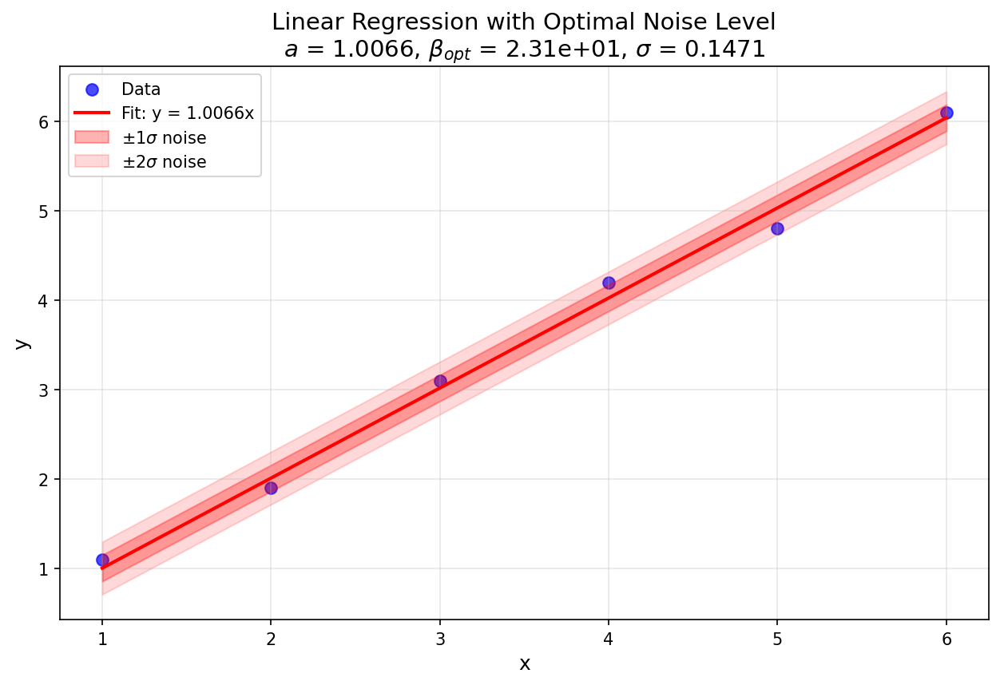
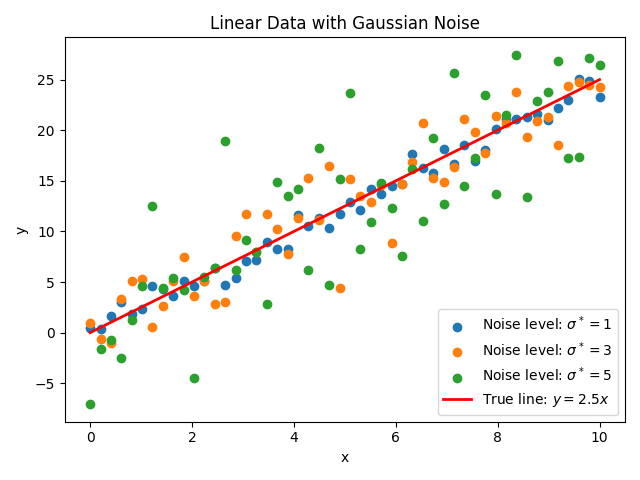
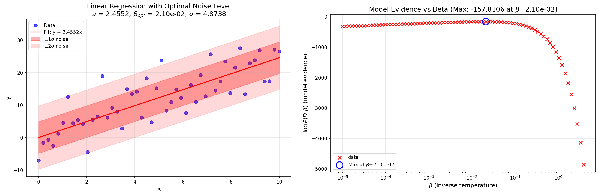

例: 線形回帰とノイズ推定
========================

はじめに
--------

このチュートリアルでは、ODAT-SEフレームワークを使用して線形回帰解析を実行し、ベイズ推論と分配関数法を通じて実験データのノイズレベルを推定する方法を示します。このチュートリアルの目標は、モデルエビデンスを最大化することにより、実験データの最適なノイズレベルを自動的に決定する方法を実際に試してみることです。

理論的基礎
----------

パラメータ推定のためのベイズフレームワーク
~~~~~~~~~~~~~~~~~~~~~~~~~~~~~~~~~~~~~~~~~~

実験測定データ :math:`D \equiv \{(x_{\mu,i},y_{\mu,i})\}_{\mu,i}` を考えます。ここで: 

- :math:`i` は各データセットの :math:`n` 個のデータポイントの各々のインデックスです (:math:`i` は1から :math:`n`)。
- :math:`\mu` は :math:`N` 個のデータセットの各々のインデックスです (:math:`\mu` は1から :math:`N`)。データセットは同じモデルに従うとします。(例: 異なる試行からのデータ、異なるXRDスポットからのデータなど)
- :math:`(x_{\mu,i},y_{\mu,i})` は :math:`\mu` 番目のデータセットの :math:`i` 番目の測定値を表します。

我々の目標は以下を推定することです: 

1. 状態量 :math:`x` を観測値 :math:`y` にマッピングするモデルのパラメータ :math:`\theta`、および
2. 実験データのノイズレベル :math:`\sigma`。

このチュートリアルでは、観測データに対して線形回帰を実行して前者の線形モデルを取得し、モデルエビデンスに対する最尤推定を使用して後者を決定します。

尤度関数の定義
^^^^^^^^^^^^^^

計算値と観測値の間の"距離"の評価には残差平方和を用います: 

.. math::

        f(\theta; D) = \sum_{\mu=1}^{N} w_\mu \sum_{i=1}^n \left(y_{\mu,i} - y_{\mu,i}^{(\text{cal})}(x_{\mu,i}; \theta)\right)^2

標準偏差 :math:`\sigma` のガウスノイズを仮定すると、単一データポイントの尤度関数(与えられたモデルの下での観測値 :math:`y_{\mu,i}` の尤度)は: 

.. math::

        P(x_{\mu,i},y_{\mu,i}|\theta; \beta) = \sqrt{\frac{\beta w_\mu}{\pi}} \exp\left(-\beta w_\mu \left(y_{\mu,i} - y_{\mu,i}^{(\text{cal})}(x_{\mu,i}; \theta)\right)^2\right)

ここで、:math:`\beta = (2\sigma^2)^{-1}` は逆温度パラメータであり、予測された状態量 :math:`x` とともにモデルをパラメータ化します。

すべての測定値の総尤度は、与えられたモデルの下での個々の点の尤度の積となります:

.. math::

        P(D|\theta; \beta) = \prod_{\mu=1}^{N} \prod_{i=1}^n P(x_{\mu,i},y_{\mu,i}|\theta; \beta) = \left(\prod_{\mu=1}^{N} \left(\frac{\beta w_\mu}{\pi}\right)^{n/2}\right) \exp\left(-\beta f(\theta; D)\right)

モデルエビデンスの定義
^^^^^^^^^^^^^^^^^^^^^^^^^^^^^^^^

パラメータ空間 :math:`\Omega` 上で一様な事前分布を仮定します: 

.. math::

        P(\theta) = \frac{1}{V_\Omega}

ここで、:math:`V_\Omega = \int_\Omega dx` は規格化因子です。モデルエビデンス(周辺尤度に対応)は、すべての可能なパラメータ値について周辺化することによって得られます: 

.. math::

        P(D; \beta) = \int_\Omega P(D|\theta; \beta) P(\theta) d\theta=\frac{1}{V_\Omega} \left(\prod_{\mu=1}^{N} \left(\frac{\beta w_\mu}{\pi}\right)^{n/2}\right) \int_\Omega \exp\left(-\beta f(\theta; D)\right) d\theta

分配関数を次のように定義できます: 

.. math::

        Z(D; \beta) \equiv \int_\Omega \exp\left(-\beta f(\theta; D)\right) d\theta

従って、モデルエビデンスは次のように書けます: 

.. math::

        P(D; \beta) = \frac{Z(D; \beta)}{V_\Omega} \prod_{\mu=1}^{N} \left(\frac{\beta w_\mu}{\pi}\right)^{n/2}

線形回帰の解析解
~~~~~~~~~~~~~~~~

単一のデータセットがあると仮定します。単純な線形モデル :math:`y = ax` について、目的関数(残差平方和)は: 

.. math::

        f(a; D) = \sum_{i=1}^n (y_i - ax_i)^2

目的関数を展開すると、次が得られます: 

.. math::

        f(a; D) = \sum_{i=1}^n (y_i - ax_i)^2 = a^2 \left(\sum_{i=1}^n x_i^2\right) - 2a \left(\sum_{i=1}^n x_i y_i\right) + \sum_{i=1}^n y_i^2

次のように A, B, C を導入すると: 

.. math::

        A \equiv \sum_{i=1}^n x_i^2, \quad B \equiv \sum_{i=1}^n x_i y_i, \quad C \equiv \sum_{i=1}^n y_i^2

平方完成により、目的関数を次のように書き直すことができます: 

.. math::

        f(a; D) = A\left(a - \frac{B}{A}\right)^2 + C - \frac{B^2}{A} \equiv A(a - a^*)^2 + f^*

以上から次のことが分かります:

- :math:`a^* = \frac{B}{A}` は最適フィッティングパラメータ、および
- :math:`f^* = C - \frac{B^2}{A}` は :math:`f(a^*; D)` におけるコスト関数 :math:`f` の最小値です。

モデルエビデンスの計算
^^^^^^^^^^^^^^^^^^^^^^^^^^^^^^^^

モデルエビデンスを評価するには、まず分配関数 :math:`Z(D|\beta)` を計算する必要があります。目的関数 :math:`f(a; D)` を使用した分配関数を考えます。ここで、モデルパラメータ :math:`a` の定義域は :math:`[-L/2, L/2]` です。

.. math::

        Z(D; \beta) = \int_{-L/2}^{L/2} \exp(-\beta f(a; D)) da = \int_{-L/2}^{L/2} \exp(-\beta[A(a - a^*)^2 + f^*]) da

変数変換 :math:`t = a - a^*` を実行し、評価前に定数因子を積分の外に移動します: 

.. math::

        Z(D; \beta) = e^{-\beta f^*} \int_{-L/2-a^*}^{L/2-a^*} \exp(-\beta A t^2) dt=e^{-\beta f^*} \frac{1}{\sqrt{\beta A}} \frac{\sqrt{\pi}}{2} \left[\text{erf}\left(\sqrt{\beta A}\left(\frac{L}{2} - a^*\right)\right) - \text{erf}\left(\sqrt{\beta A}\left(-\frac{L}{2} - a^*\right)\right)\right]

上記では、誤差関数の積分としての定義を使用しました: 

.. math::

        \int_0^y e^{-\gamma t^2} dt = \frac{1}{\sqrt{\gamma}} \frac{\sqrt{\pi}}{2} \text{erf}(\sqrt{\gamma} y)

したがって、モデルエビデンスは次のように書き出すことができます: 

.. math::

        P(D; \beta) = \frac{1}{L} \left(\frac{\beta}{\pi}\right)^{(n-1)/2} \frac{e^{-\beta f^*}}{2\sqrt{A}} \left[\text{erf}\left(\sqrt{\beta A}\left(\frac{L}{2} - a^*\right)\right) - \text{erf}\left(\sqrt{\beta A}\left(-\frac{L}{2} - a^*\right)\right)\right]

誤差関数は、その引数が :math:`\infty` と :math:`-\infty` に近づくにつれて、それぞれ1と-1に近づきます。:math:`L` を十分に大きく取ると、モデルエビデンスについて次の結果が得られます: 

.. math::

        P(D; \beta) \approx \frac{1}{L} \left(\frac{\beta}{\pi}\right)^{(n-1)/2} \frac{e^{-\beta f^*}}{\sqrt{A}}

ノイズレベルの推定
^^^^^^^^^^^^^^^^^^

最尤原理はノイズレベルを推定する指針となります。モデルエビデンスの対数を :math:`\beta` について最大化すると(大きな :math:`L` の極限で)、次が得られます: 

.. math::

        \frac{d}{d\beta} \log P(D; \beta) = \frac{n-1}{2\beta} - f^* = 0

最適な逆温度と関連するノイズレベルは、次のように決定できます: 

.. math::

        \beta_{\text{opt}} = \frac{n-1}{2f^*}\implies\sigma_{\text{opt}} = \frac{1}{\sqrt{2\beta_{\text{opt}}}} = \sqrt{\frac{f^*}{n-1}}

これにより、最尤原理に基づくデータ駆動によるノイズレベル推定が可能になります。

ODAT-SE実装
-----------

コード実装
~~~~~~~~~~

このチュートリアルで用いるファイルは、ソースファイル中の ``sample/linreg_with_noise`` に配置されています。メインスクリプトは ``linreg_with_noise.py`` です。

ユーザー定義ターゲット関数
^^^^^^^^^^^^^^^^^^^^^^^^^^

ODAT-SEフレームワークでは、ユーザーが ``SolverBase`` クラスを継承してカスタムソルバーを定義することができるようになっています。ここでは、線形回帰ソルバーを作成する方法を示します。

.. code:: python

        #!/usr/bin/env python
        """
        Integrated linear regression and model evidence analysis
        Combines custom ODAT-SE solver implementing linear regression with model evidence calculation
        """

        import odatse
        import sys, os, argparse
        import numpy as np
        from matplotlib import pyplot as plt
        from odatse.algorithm import choose_algorithm
        sys.path.append("../../script")
        from plt_model_evidence import load_data, calc_log_pdb, print_log_pdb, plot_log_pdb

        class LinearRegression(odatse.solver.SolverBase):
                """Linear regression solver class"""

                def __init__(self, info):
                        super().__init__(info)
                        data_file = info.solver["reference"]["path"]
                        data = np.loadtxt(data_file, unpack=True)

                        self.xdata = data[0]
                        self.ydata = data[1]
                        self.n = len(self.ydata)

                def evaluate(self, xs, args, nprocs=1, nthreads=1):
                        loss = np.sum((xs*self.xdata - self.ydata)**2)
                        return loss

ターゲット関数は ``evaluate`` 関数で定義されます。ここでは、残差平方和を表す2次関数の損失関数を使用します。

モデルエビデンスの計算
^^^^^^^^^^^^^^^^^^^^^^^^^^^^^^^^

モデルエビデンスの計算については、後処理ツール ``plt_model_evidence.py`` から関数をインポートします(詳細については、:doc:`../post/index` を参照)。線形フィットとノイズバンドをプロットするために、次の関数を使用します: 

.. code:: python

        def plot_linear_fit_with_noise(xdata, ydata, a, noise_level, beta_opt, output_file):
                fig, ax = plt.subplots(figsize=(10, 6))

                # Plot original data points and fitted line
                ax.scatter(xdata, ydata, s=50, alpha=0.7, label='Data', color='blue')
                x_fit = np.linspace(xdata.min(), xdata.max(), 100)
                y_fit = a * x_fit
                ax.plot(x_fit, y_fit, 'r-', linewidth=2, label=f'Fit: y = {a:.4f}x')

                # Add noise bands (\pm1\sigma, \pm2\sigma)
                ax.fill_between(x_fit, y_fit - noise_level, y_fit + noise_level,
                                                alpha=0.3, color='red', label=f'$\\pm1\\sigma$ noise')
                ax.fill_between(x_fit, y_fit - 2*noise_level, y_fit + 2*noise_level,
                                                alpha=0.15, color='red', label=f'$\\pm2\\sigma$ noise')

                ax.set_xlabel('x', fontsize=12)
                ax.set_ylabel('y', fontsize=12)
                ax.set_title(f'Linear Regression with Optimal Noise Level\n' +
                                        f'$a$ = {a:.4f}, $\\beta_{{opt}}$ = {beta_opt:.2e}, $\\sigma$ = {noise_level:.4f}', fontsize=14)
                ax.legend(loc='best')
                ax.grid(True, alpha=0.3)

                fig.savefig(output_file, dpi=150, bbox_inches='tight')
                plt.close()
                print(f"Linear fit plot saved to: {output_file}")

メイン関数は、TOMLファイルを入力として受け取り、オプションでログファイルを指定します。その他の引数には、事前分布の正規化係数と、モデルエビデンスプロットを可視化する際のプロットウィンドウ選択に関連する引数が含まれます。

.. code:: python

        if __name__ == "__main__":
                parser = argparse.ArgumentParser(description='Integrated linear regression and model evidence analysis')
                # Basic parameters
                parser.add_argument('--input', type=str, default='input.toml',
                                                   help='ODAT-SE input configuration file path')
                parser.add_argument('--logfile', type=str, default=None,
                                                   help='ODAT-SE run log file (default: output_dir/odatse_run.log)')
                # Model evidence calculation parameters
                parser.add_argument('-V', '--volume', type=float, default=1.0,
                                                   help='Normalization factor of prior probability distribution (default is 1.0)')
                # Auto-focus parameters
                parser.add_argument('--auto-focus', action='store_true',
                                                   help='Auto-focus on maximum model evidence region')
                parser.add_argument('--focus-factor', type=float, default=0.5,
                                                   help='Auto-focus tightness (0-1, smaller is tighter, default: 0.5)')
                args = parser.parse_args()

                # Run main program
                print("="*60)
                print("Starting Linear Regression and Model Evidence Analysis")
                print("="*60)

                # Step 1: Run ODAT-SE
                print("\nStep 1: Running ODAT-SE linear regression...")

                sys.argv = ["script.py", args.input, "--init"]

                original_stdout = sys.stdout
                original_stderr = sys.stderr

                # Initialize ODAT-SE to get output directory
                info, run_mode = odatse.initialize()
                output_dir = info.base.get("output_dir", "./output")

                # Create output directory if it doesn't exist
                os.makedirs(output_dir, exist_ok=True)

                # Set log file path
                if args.logfile is None:
                        args.logfile = os.path.join(output_dir, "odatse_run.log")

                # Run ODAT-SE
                with open(args.logfile, "w") as f:
                        sys.stdout = f
                        sys.stderr = f

                        solver = LinearRegression(info)
                        runner = odatse.Runner(solver, info)
                        alg_module = choose_algorithm(info.algorithm["name"])
                        alg = alg_module.Algorithm(info, runner, run_mode=run_mode)
                        result = alg.main()

                        sys.stdout = original_stdout
                        sys.stderr = original_stderr
                print("ODAT-SE run completed")
                print(f"Output directory: {output_dir}")

                # Get fitting parameters
                a = result['x'][0]
                xdata = solver.xdata
                ydata = solver.ydata
                n_data = solver.n
                print(f"\nFitting results:")
                print(f"  Slope a = {a:.6f}")
                print(f"  Number of data points n = {n_data}")

                # Step 2: Load fx.txt data and calculate model evidence
                print("\nStep 2: Calculating model evidence...")
                fx_file = os.path.join(output_dir, "fx.txt")
                if not os.path.exists(fx_file):
                        raise FileNotFoundError(f"Error: Cannot find file {fx_file}")
                beta, logz = load_data(fx_file)
                log_pdb = calc_log_pdb(beta, logz, np.asarray([n_data], dtype=np.int64), np.asarray([1], dtype=np.float64), args.volume)

                # Save model evidence data
                evidence_file = os.path.join(output_dir, "model_evidence.txt")
                print_log_pdb(evidence_file, beta, log_pdb)

                # Step 3: Find optimal beta value
                print("\nStep 3: Finding optimal beta value...")
                valid_mask = np.isfinite(log_pdb) & np.isfinite(beta)
                if not np.any(valid_mask):
                        raise ValueError("No valid data points")
                max_idx = np.argmax(log_pdb[valid_mask])
                beta_opt = beta[valid_mask][max_idx]
                log_pdb_max = log_pdb[valid_mask][max_idx]
                print(f"\nOptimal parameters:")
                print(f"  beta_opt = {beta_opt:.6e}")
                print(f"  log P(D;beta_opt) = {log_pdb_max:.6f}")

                # Step 4: Calculate noise level
                noise_level = 1.0 / np.sqrt(2.0 * beta_opt)
                print(f"\nNoise level:")
                print(f"  std = 1/sqrt(2*beta_opt) = {noise_level:.6f}")

                # Calculate R^2 value
                y_pred = a * xdata
                ss_res = np.sum((ydata - y_pred)**2)
                ss_tot = np.sum((ydata - np.mean(ydata))**2)
                r_squared = 1 - (ss_res / ss_tot) if ss_tot != 0 else 0
                print(f"\nFitting quality:")
                print(f"  R^2 = {r_squared:.6f}")
                print(f"  Residual sum of squares = {ss_res:.6f}")

                # Step 5: Generate plots
                print("\nStep 5: Generating plots...")

                # Plot model evidence and linear fit with noise bands
                evidence_plot = os.path.join(output_dir, "model_evidence.png")
                plot_log_pdb(evidence_plot, beta, log_pdb, None, args.auto_focus, args.focus_factor)
                fit_plot = os.path.join(output_dir, "linear_fit_with_noise.png")
                plot_linear_fit_with_noise(xdata, ydata, a, noise_level, beta_opt, output_file=fit_plot)

                # Save results to file
                print("\nStep 6: Saving results...")
                results_file = os.path.join(output_dir, "analysis_results.txt")
                with open(results_file, "w") as f:
                        f.write("Linear regression and model evidence analysis results\n")
                        f.write("="*50 + "\n\n")
                        f.write(f"Fitting parameters:\n")
                        f.write(f"  Slope a = {a:.6f}\n")
                        f.write(f"  Number of data points n = {n_data}\n\n")
                        f.write(f"Optimal parameters:\n")
                        f.write(f"  beta_opt = {beta_opt:.6e}\n")
                        f.write(f"  log P(D;beta_opt) = {log_pdb_max:.6f}\n\n")
                        f.write(f"Noise level:\n")
                        f.write(f"  std = {noise_level:.6f}\n\n")
                        f.write(f"Fitting quality:\n")
                        f.write(f"  R^2 = {r_squared:.6f}\n")
                        f.write(f"  Residual sum of squares = {ss_res:.6f}\n")
                print(f"Results saved to: {results_file}")
                print("\n" + "="*60)
                print("Analysis completed!")
                print(f"All output files are saved in: {output_dir}")
                print("="*60)

実行例
------

例1: 6点線形回帰
~~~~~~~~~~~~~~~~

ステップ1: 入力データの準備
^^^^^^^^^^^^^^^^^^^^^^^^^^^

2列(x値とy値)のデータファイル ``data.txt`` を作成します: 

.. code:: text

        1.0 1.1
        2.0 1.9
        3.0 3.1
        4.0 4.2
        5.0 4.8
        6.0 6.1

ステップ2: ODAT-SE入力ファイルの作成
^^^^^^^^^^^^^^^^^^^^^^^^^^^^^^^^^^^^

ODATSEの仕様に従って ``input.toml`` を作成します (モデルエビデンスはレプリカ交換モンテカルロ(exchange)およびポピュレーションアニーリング・モンテカルロ(PAMC)アルゴリズムで利用可能): 

.. code:: toml

        [base]
        dimension = 1
        output_dir = "./output_data"

        [solver]
        name = "user"

        [solver.reference]
        path = "./data.txt"

        [algorithm]
        name = "pamc"
        seed = 12345
        label_list = ["a"]

        [algorithm.param]
        min_list = [-20.0]
        max_list = [20.0]
        step_list = [0.05]

        [algorithm.pamc]
        Tnum = 100
        bmin = 1e-5
        bmax = 1e2
        Tlogspace = true
        numsteps_annealing = 100
        nreplica_per_proc = 10

ステップ3: 解析の実行
^^^^^^^^^^^^^^^^^^^^^

スクリプトを実行し、``input.toml`` を入力引数として渡します: 

.. code:: bash

        python linreg_with_noise.py input.toml

自動フォーカス機能を使用して、モデルエビデンスプロットの最大値を含む適切なプロットウィンドウを決定するには、オプションの ``--auto-focus`` をセットし、0から1のフォーカス係数 ``--focus-factor`` (デフォルト: 0.5)パラメータを指定します。

.. code:: bash

        python linreg_with_noise.py input.toml --auto-focus --focus-factor 0.3

理論計算
^^^^^^^^

上記で用いたデータは次の6点からなります:

.. math::

        (x_1, y_1) = (1, 1.1), \quad (x_2, y_2) = (2, 1.9), \quad (x_3, y_3) = (3, 3.1), \quad (x_4, y_4) = (4, 4.2), \quad (x_5, y_5) = (5, 4.8), \quad (x_6, y_6) = (6, 6.1)

前に提示した式を適用すると、:math:`a^*`、:math:`f^*`、および :math:`\beta_{\text{opt}}` と :math:`\sigma_{\text{opt}}` の理論値は次のように計算できます: 

.. math::

        a^* = \frac{\sum_{i=1}^6 x_i y_i}{\sum_{i=1}^6 x_i^2} = \frac{91.6}{91} \approx 1.00659, \quad f^* = \sum_{i=1}^6 y_i^2 - \frac{(\sum_{i=1}^6 x_i y_i)^2}{\sum_{i=1}^6 x_i^2} = 92.32 - \frac{(91.6)^2}{91} \approx 0.11604

.. math::

        \beta_{\text{opt}} = \frac{n-1}{2f^*} \approx 21.544 \implies \sigma_{\text{opt}} = \frac{1}{\sqrt{2\beta_{\text{opt}}}} \approx 0.15234

数値結果
^^^^^^^^

PAMCアルゴリズムを用いた計算から以下の値が得られます: 

- :math:`a^* = 1.0066` (数値)
- :math:`\beta_{\text{opt}} = 23.101` (数値)
- :math:`\sigma_{\text{opt}} = 0.14712` (:math:`\beta_{\text{opt}}` から)

:math:`\beta` 値のわずかな違いを引き起こす要因には、アニーリングスケジュールにおいて温度刻みが離散的であること、およびモンテカルロ法での有限サンプリングによる分配関数推定の統計的変動があります。

        図1: この例で使用されたデータセットの線形回帰プロット。

推定されたノイズレベル :math:`\sigma \approx 0.1` は、フィッティングされた直線からの :math:`y_i` の偏差を考えると妥当です。

例2: 異なるノイズレベルでの人工データ
~~~~~~~~~~~~~~~~~~~~~~~~~~~~~~~~~~~~~

この例では、3つの異なるノイズレベルでのデータを使用してモデルエビデンスを最大化することにより、ノイズ推定手法のロバスト性を示します。

ステップ1: 入力データの準備
^^^^^^^^^^^^^^^^^^^^^^^^^^^

以下は、ノイズレベルを変えたガウスノイズを乗せた線形データを生成するPythonスクリプトです。

.. code:: python

        import numpy as np
        import matplotlib.pyplot as plt

        np.random.seed(42)

        n_samples = 50
        x = np.linspace(0, 10, n_samples)

        a = 2.5
        y_true = a * x

        noise_levels = [1, 3, 5]

        file_names = []
        for noise in noise_levels:
                y_noisy = y_true + np.random.normal(0, noise, size=n_samples)
                data = np.column_stack((x, y_noisy))
                file_name = f"linear_data_gaussian_noise{noise}.txt"
                np.savetxt(file_name, data, comments='', fmt="%.6f")
                file_names.append(file_name)
                plt.scatter(x, y_noisy, label=f'Noise level: {noise}')

        plt.plot(x, y_true, color='red', label='True line', linewidth=2)
        plt.xlabel('x')
        plt.ylabel('y')
        plt.title('Linear Data with Gaussian Noise')
        plt.legend()
        plt.savefig("linear_data_gaussian_noise.png")

このスクリプトによって生成されたデータセットを以下にプロットします。

        図2: 関数 :math:`y=2.5x` から生成され、レベル :math:`\sigma^*=1,3,5` でガウスノイズが追加された人工データ。

ステップ2: ODAT-SE入力ファイルの作成
^^^^^^^^^^^^^^^^^^^^^^^^^^^^^^^^^^^^

前の例と同じ入力ファイルを使用できます。``[base]`` の下の ``output_dir`` の値と ``[solver.reference]`` の下の ``path`` を、出力ディレクトリと入力ファイルへの適切なパスに置き換えます(ファイル名は ``data_noise#.txt`` の形式で、``#`` はノイズ付き入力データを生成する上記のスクリプトから取得されたノイズレベルを示します)。

ステップ3: 解析の実行
^^^^^^^^^^^^^^^^^^^^^

前の例と同様に、3つのデータセットのそれぞれについて(入力ファイルに適切な変更を加えて)スクリプトを実行し、``input.toml`` を入力引数として指定します: 

.. code:: bash

        python linreg_with_noise.py input.toml

自動フォーカス機能を使用すると、呼び出しは次のようになります: 

.. code:: bash

        python linreg_with_noise.py input.toml --auto-focus --focus-factor 0.3

数値結果
^^^^^^^^

3つのデータセットのそれぞれに対して線形回帰とノイズ推定を実行すると、次の結果が得られます: 

.. raw:: html

        
        <table>
                <colgroup>
                        <col>
                        <col style="border-right: 2px solid black;">
                        <col>
                        <col>
                </colgroup>
                <thead>
                        <tr>
                                <td style="text-align: center;">傾き</td>
                                <td style="text-align: center;">ノイズレベル</td>
                                <td style="text-align: center;">フィッティングされた傾き</td>
                                <td style="text-align: center;">推定されたノイズレベル</td>
                        </tr>
                </thead>
                <tbody>
                        <tr>
                                <td style="text-align: center;">$$a^*=2.5$$</td>
                                <td style="text-align: center;">$$\sigma^*=1$$</td>
                                <td style="text-align: center;">$$a=2.4516$$</td>
                                <td style="text-align: center;">$$\sigma=0.8820$$</td>
                        </tr>
                        <tr>
                                <td style="text-align: center;">$$a^*=2.5$$</td>
                                <td style="text-align: center;">$$\sigma^*=3$$</td>
                                <td style="text-align: center;">$$a=2.4844$$</td>
                                <td style="text-align: center;">$$\sigma=2.5412$$</td>
                        </tr>
                        <tr>
                                <td style="text-align: center;">$$a^*=2.5$$</td>
                                <td style="text-align: center;">$$\sigma^*=5$$</td>
                                <td style="text-align: center;">$$a=2.4552$$</td>
                                <td style="text-align: center;">$$\sigma=4.8738$$</td>
                        </tr>
                </tbody>
        </table>

.. raw:: latex

        \begin{tabular}{cc|cc}
        傾き & ノイズレベル & フィッティングされた傾き & 推定されたノイズレベル \\
        \hline
        $a^*=2.5$ & $\sigma^*=1$ & $a=2.4516$ & $\sigma=0.8820$ \\
        $a^*=2.5$ & $\sigma^*=3$ & $a=2.4844$ & $\sigma=2.5412$ \\
        $a^*=2.5$ & $\sigma^*=5$ & $a=2.4552$ & $\sigma=4.8738$ \\
        \end{tabular}

.. .. csv-table::
..   :header: "slope", "noise level", "fitted slope", "estimated noise level"
..   :widths: 20,20,30,30
..
..   :math:`a^* = 2.5`, :math:`\sigma^* = 1`, :math:`a = 2.4516`, :math:`\sigma = 0.8820`
..   :math:`a^* = 2.5`, :math:`\sigma^* = 3`, :math:`a = 2.4844`, :math:`\sigma = 2.5412`
..   :math:`a^* = 2.5`, :math:`\sigma^* = 5`, :math:`a = 2.4552`, :math:`\sigma = 4.8738`

モデルがノイズレベル :math:`\sigma=5` の場合の回帰プロットとモデルエビデンスプロットを以下に示します。

        図3: ノイズレベル :math:`\sigma^*=5` でのデータセットの線形回帰プロットとモデルエビデンスプロット。
